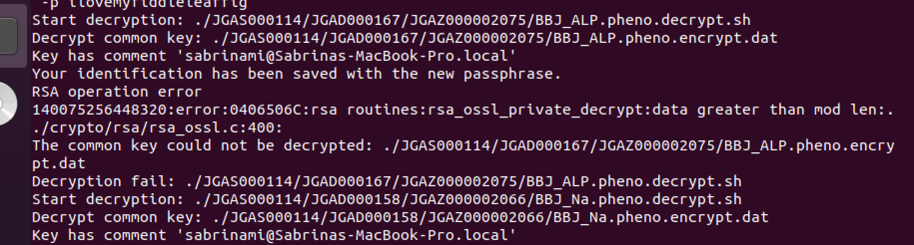

The same info can be found at this page, https://www.ddbj.nig.ac.jp/jga/download-e.html, but the steps may be slightly different because we applied for Biobank Japan data before they integrated with the D-way system.


### Register a user account:
1. A D-way account should have been created for you, with your username and password sent in an email. If not, create an account here: https://ddbj.nig.ac.jp/D-way/contents/general/reserve_account_page
2. **Add UChicago as your organization**: Log in with D-way account, https://ddbj.nig.ac.jp/D-way/. Click the account tab at the top right corner, and at the bottom, type "The University of Chicago" in Center Full Name. Once selected, center name autofills with "U_CHICAGO". 
3. **Register your public key**: You may need to click update and refresh for the Public Key box to appear at the bottom. You will need to copy your public key to an unhidden folder, `cp ~/.ssh/id_rsa.pub ~/Desktop`, before selecting for upload. If you do not find a file named `id_rsa.pub` in `.ssh`, create a public key with `ssh-keygen -t rsa`.
**Note:** The keypair you register will be used for downloading and decrypting data, and cannot be changed. Choose a public key generated by a lab computer (Mac or Linux) or the machine where the data will be stored. 


### Download Data:
1. Connect to JGA server: `sftp -i id_rsa -P 443 <D-way username>@jga-gw.ddbj.nig.ac.jp` 
2. `cd controlled-access/download/jga/`
3. Download genotypes: `get -r J-DU000138/JGAS000114/JGAD000123`
4. Download a phenotype: `get -r J-DU000138/JGAS000114/JGAD000***` (each folder contains encrypted individual data for one phenotype)
5. Download decryption tools: `get -r J-DU000138/tools`

I wrote a [batch script](get_phenotypes.txt) and ran the following lines to download all the phenotypes:
```
ssh-add
cd BBJ
mkdir JGAS000114
cd JGAS000114
sftp -i ~/.ssh/id_rsa -P 443 -b get_phenotypes.txt scmi@jga-gw.ddbj.nig.ac.jp
```

### Decrypt Data

1. `cd BBJ`
2. `unzip tools/J-DU000138.tool.zip`
3. `chmod 754 J-DU000138.decrypt.sh`
4. `chmod 754 JGAS000114/**/**/*.decrypt.sh`
5. Decrypt: `./J-DU000138.decrypt.sh -k ~/.ssh/id_rsa -p <private key password>`

If you find the following error message:



When I ran into this issue, the problem was that the tool folder provided was not encrypted with my public. If you email the NBDC contact with your public key, the updated tools folder should work.
