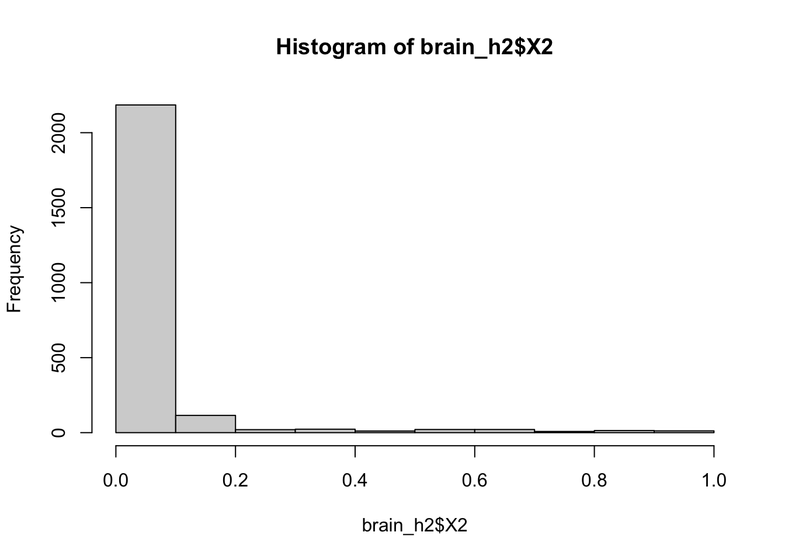

After receiving a .RAR file with reaction rate data for 13 brain tissue samples, we wanted to calculate h2 and see if any of the thousands of reactions were heritable.

These are the packages necessary to run this analysis, along with the path to the list of 13 brain tissue data sets.

We then created a pipeline to coalesce all 13 files into one and create the long format of that data. The pipeline is as follows:

```         
## Warning in read_fun(path = enc2native(normalizePath(path)), sheet_i = sheet, :
## Coercing boolean to numeric in GJ3243 / R3243C192
```

This pipeline simply reads each file in the list of 13 and then creates a column to say which tissue that sample came from. Finally it creates the long format using pivot_longer()

Next - I created an intermediary data frame `x` that has an additional column for individual_id. I then grouped by individual_id and reaction_id and summarized.

The groupby() command will only include unique reaction_id/individual_id pairs so that any pairs that were common across tissues will be parsed into one and given the average value.

Finally, we created the wide formate of the data that can be read by gcta for h2 calculation.

Above, we added an additional column for Family_ID that is the same as Individual_ID. We also filtered at this step. This is important since normally we would have filtered during the pipeline step. We filtered for reaction ids whose average across the column was \<0.9 and \>0.1 so that those reactions are variable across the population.

We filtered here as to not introduce NAs into the wide formate of teh data since gcta could not appropriately handle NAs.

We can check that there are no NAs using the function below

``` r
summary(apply(widedata[,-c(1,2)],2,mean))
```

```         
##    Min. 1st Qu.  Median    Mean 3rd Qu.    Max. 
##  0.1001  0.2662  0.4924  0.5048  0.7666  0.8994
```

GCTA can then calculate h2 for all 2430 phenotypes. {width="672"}{width="672"}

Sadly the histograms for both h2 and pvalues do not look significant.
