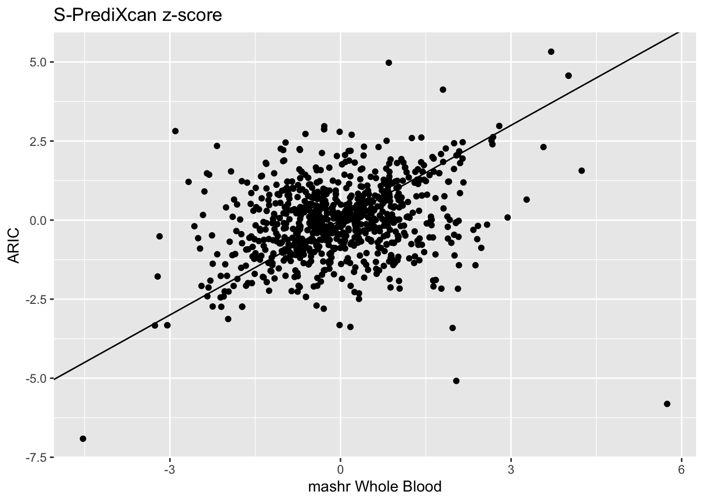

::: {.container-fluid .main-container}
::: {#header .fluid-row}
# psychencode_hg38_validation {#psychencode_hg38_validation .title .toc-ignore}

#### 2020-12-22 {#section .date}
:::

workflowr

::: {#workflowr-report .collapse}
-   [Summary](#summary){toggle="tab"}
-   [Checks ](#checks){toggle="tab"}
-   [Past versions](#versions){toggle="tab"}

::: tab-content
::: {#summary .tab-pane .fade .in .active}
**Last updated:** 2021-09-08

**Checks:** 5 2

**Knit directory:** `~/Github/ARIC/`

This reproducible [R Markdown](http://rmarkdown.rstudio.com) analysis was created with [workflowr](https://github.com/jdblischak/workflowr) (version 1.6.2). The *Checks* tab describes the reproducibility checks that were applied when the results were created. The *Past versions* tab lists the development history.

------------------------------------------------------------------------
:::

::: {#checks .tab-pane .fade}
::: {#workflowr-checks .panel-group}
::: {.panel .panel-default}
::: panel-heading
[ **R Markdown file:** uncommitted changes](#strongRMarkdownfilestronguncommittedchanges){toggle="collapse" parent="#workflowr-checks"}
:::

::: {#strongRMarkdownfilestronguncommittedchanges .panel-collapse .collapse}
::: panel-body
The R Markdown is untracked by Git. To know which version of the R Markdown file created these results, you'll want to first commit it to the Git repo. If you're still working on the analysis, you can ignore this warning. When you're finished, you can run `wflow_publish` to commit the R Markdown file and build the HTML.
:::
:::
:::

::: {.panel .panel-default}
::: panel-heading
[ **Environment:** empty](#strongEnvironmentstrongempty){toggle="collapse" parent="#workflowr-checks"}
:::

::: {#strongEnvironmentstrongempty .panel-collapse .collapse}
::: panel-body
Great job! The global environment was empty. Objects defined in the global environment can affect the analysis in your R Markdown file in unknown ways. For reproduciblity it's best to always run the code in an empty environment.
:::
:::
:::

::: {.panel .panel-default}
::: panel-heading
[ **Seed:** `set.seed(12345)`](#strongSeedstrongcodesetseed12345code){toggle="collapse" parent="#workflowr-checks"}
:::

::: {#strongSeedstrongcodesetseed12345code .panel-collapse .collapse}
::: panel-body
The command `set.seed(12345)` was run prior to running the code in the R Markdown file. Setting a seed ensures that any results that rely on randomness, e.g. subsampling or permutations, are reproducible.
:::
:::
:::

::: {.panel .panel-default}
::: panel-heading
[ **Session information:** recorded](#strongSessioninformationstrongrecorded){toggle="collapse" parent="#workflowr-checks"}
:::

::: {#strongSessioninformationstrongrecorded .panel-collapse .collapse}
::: panel-body
Great job! Recording the operating system, R version, and package versions is critical for reproducibility.
:::
:::
:::

::: {.panel .panel-default}
::: panel-heading
[ **Cache:** none](#strongCachestrongnone){toggle="collapse" parent="#workflowr-checks"}
:::

::: {#strongCachestrongnone .panel-collapse .collapse}
::: panel-body
Nice! There were no cached chunks for this analysis, so you can be confident that you successfully produced the results during this run.
:::
:::
:::

::: {.panel .panel-default}
::: panel-heading
[ **File paths:** absolute](#strongFilepathsstrongabsolute){toggle="collapse" parent="#workflowr-checks"}
:::

::: {#strongFilepathsstrongabsolute .panel-collapse .collapse}
::: panel-body
Using absolute paths to the files within your workflowr project makes it difficult for you and others to run your code on a different machine. Change the absolute path(s) below to the suggested relative path(s) to make your code more reproducible.

| absolute                                        | relative           |
|:------------------------------------------------|:-------------------|
| /Users/sabrinami/Github/ARIC/test_data/GWAS     | test_data/GWAS     |
| /Users/sabrinami/Github/ARIC/results/SPrediXcan | results/SPrediXcan |
| /Users/sabrinami/Github/ARIC/models             | models             |
| /Users/sabrinami/Github/ARIC/code               | code               |
:::
:::
:::

::: {.panel .panel-default}
::: panel-heading
[ **Repository version:** No commits yet](#strongRepositoryversionstrongNocommitsyet){toggle="collapse" parent="#workflowr-checks"}
:::

::: {#strongRepositoryversionstrongNocommitsyet .panel-collapse .collapse}
::: panel-body
Great! You are using Git for version control. Tracking code development and connecting the code version to the results is critical for reproducibility.

Note that you need to be careful to ensure that all relevant files for the analysis have been committed to Git prior to generating the results (you can use `wflow_publish` or `wflow_git_commit`). workflowr only checks the R Markdown file, but you know if there are other scripts or data files that it depends on. Below is the status of the Git repository when the results were generated:

```         
Untracked files:
    Untracked:  .DS_Store
    Untracked:  .Rhistory
    Untracked:  ARIC_EA_hg38_validation.Rmd
    Untracked:  ARIC_EA_hg38_validation_height.Rmd
    Untracked:  ARIC_EA_hg38_validation_height.html
    Untracked:  PWAS/
    Untracked:  code/
    Untracked:  covariances_EA_hg38.Rmd
    Untracked:  figure/
    Untracked:  models/
    Untracked:  results/
    Untracked:  test_data/
    Untracked:  weights_EA.Rmd
    Untracked:  weights_EA.html
```

Note that any generated files, e.g. HTML, png, CSS, etc., are not included in this status report because it is ok for generated content to have uncommitted changes.
:::
:::
:::
:::

------------------------------------------------------------------------
:::

::: {#versions .tab-pane .fade}
There are no past versions. Publish this analysis with `wflow_publish()` to start tracking its development.

------------------------------------------------------------------------
:::
:::
:::

::: {#liftover .section .level1}
# Liftover

::: {#definitions .section .level2}
## Definitions

``` bash
conda activate imlabtools
METAXCAN=/Users/sabrinami/Github/MetaXcan/software
DATA=/Users/sabrinami/Github/ARIC/test_data/GWAS
RESULTS=/Users/sabrinami/Github/ARIC/results/SPrediXcan
MODEL=/Users/sabrinami/Github/ARIC/models
```
:::
:::

::: {#validation .section .level1}
# Validation

::: {#definitions-1 .section .level2}
## Definitions

.

``` r
suppressPackageStartupMessages(library(tidyverse))
suppressPackageStartupMessages(library(qqman))
suppressPackageStartupMessages(library(data.table))
suppressPackageStartupMessages(library(RSQLite))
```

``` r
DATA="/Users/sabrinami/Github/ARIC/test_data/GWAS"
RESULTS="/Users/sabrinami/Github/ARIC/results/SPrediXcan"
MODEL="/Users/sabrinami/Github/ARIC/models"
CODE="/Users/sabrinami/Github/ARIC/code"
source(glue::glue("{CODE}/load_data_functions.R"))
source(glue::glue("{CODE}/plotting_utils_functions.R"))

gencode_df = load_gencode_df()
```
:::

::: {#run-s-predixcan .section .level2}
## Run S-PrediXcan

Run S-PrediXcan with the ARIC model.

``` bash
python $METAXCAN/SPrediXcan.py \
--gwas_file  $DATA/imputed_CARDIoGRAM_C4D_CAD_ADDITIVE.txt.gz \
--snp_column panel_variant_id --effect_allele_column effect_allele --non_effect_allele_column non_effect_allele --zscore_column zscore \
--model_db_path $MODEL/ARIC_EA_hg38.db \
--covariance $MODEL/ARIC_EA_hg38.txt.gz \
--keep_non_rsid --additional_output --model_db_snp_key varID \
--throw \
--output_file $RESULTS/CAD_ARIC_hg38.csv
```

And the mashr model.

``` bash
python $METAXCAN/SPrediXcan.py \
--gwas_file  $DATA/imputed_CARDIoGRAM_C4D_CAD_ADDITIVE.txt.gz \
--snp_column panel_variant_id --effect_allele_column effect_allele --non_effect_allele_column non_effect_allele --zscore_column zscore \
--model_db_path $MODEL/mashr_Whole_Blood.db \
--covariance $MODEL/mashr_Whole_Blood.txt.gz \
--keep_non_rsid --additional_output --model_db_snp_key varID \
--throw \
--output_file $RESULTS/CAD_mashr_Whole_Blood.csv
```
:::

::: {#compare-association-results .section .level2}
## Compare Association Results

``` r
spredixcan_association_ARIC = load_spredixcan_association(glue::glue("{RESULTS}/CAD_ARIC_hg38.csv"), gencode_df)
dim(spredixcan_association_ARIC)
```

```         
[1] 1318   16
```

``` r
significant_genes_ARIC <- spredixcan_association_ARIC %>% filter(pvalue < 0.05/nrow(spredixcan_association_ARIC)) %>% arrange(pvalue)
```

``` r
spredixcan_association_Whole_Blood = load_spredixcan_association(glue::glue("{RESULTS}/CAD_mashr_Whole_Blood.csv"), gencode_df)
dim(spredixcan_association_Whole_Blood)
```

```         
[1] 12587    16
```

``` r
significant_genes_Whole_Blood <- spredixcan_association_Whole_Blood %>% filter(pvalue < 0.05/nrow(spredixcan_association_Whole_Blood)) %>% arrange(pvalue)
```

Then compare ARIC and Whole Blood z-scores.

``` r
zscores = inner_join(spredixcan_association_Whole_Blood, spredixcan_association_ARIC, by=c("gene"))
dim(zscores)
```

```         
[1] 815  31
```

``` r
zscores %>% ggplot(aes(zscore.x, zscore.y)) + geom_point() + ggtitle("S-PrediXcan z-score") + xlab("mashr Whole Blood") + ylab("ARIC") + geom_abline(intercept = 0, slope = 1)
```

```         
Warning: Removed 1 rows containing missing values (geom_point).
```



We can compare the significant genes found with the ARIC and mashr Whole Blood models.

``` r
significant_genes_ARIC[, c(1,2)]
```

```         
             gene    zscore
1 ENSG00000186063 -6.914873
2 ENSG00000160712 -5.813218
3 ENSG00000169174  5.326004
4 ENSG00000133789 -5.085480
5 ENSG00000107562  4.976651
6 ENSG00000158710  4.567579
7 ENSG00000158710  4.567579
8 ENSG00000175573  4.125269
```

``` r
significant_genes_Whole_Blood[, c(1,2)]
```

```         
              gene    zscore
1  ENSG00000134222 -9.263287
2  ENSG00000107798  7.525837
3  ENSG00000163596  7.210367
4  ENSG00000138380 -5.982736
5  ENSG00000160712  5.744854
6  ENSG00000127616  5.703439
7  ENSG00000183431 -5.382606
8  ENSG00000182511 -5.373519
9  ENSG00000115486  5.258467
10 ENSG00000084093 -5.204898
11 ENSG00000143498  4.920139
12 ENSG00000031698 -4.747462
13 ENSG00000168906 -4.698991
14 ENSG00000130475 -4.683521
15 ENSG00000119718  4.681344
```

``` r
intersect(significant_genes_ARIC$gene,significant_genes_Whole_Blood$gene)
```

```         
[1] "ENSG00000160712"
```

There is only one gene found significant in both, ENSG00000160712

\

Session information

::: {#workflowr-sessioninfo .collapse}
``` r
sessionInfo()
```

```         
R version 4.0.3 (2020-10-10)
Platform: x86_64-apple-darwin17.0 (64-bit)
Running under: macOS Big Sur 10.16

Matrix products: default
BLAS:   /Library/Frameworks/R.framework/Versions/4.0/Resources/lib/libRblas.dylib
LAPACK: /Library/Frameworks/R.framework/Versions/4.0/Resources/lib/libRlapack.dylib

locale:
[1] en_US.UTF-8/en_US.UTF-8/en_US.UTF-8/C/en_US.UTF-8/en_US.UTF-8

attached base packages:
[1] stats     graphics  grDevices utils     datasets  methods   base     

other attached packages:
 [1] RSQLite_2.2.1     data.table_1.13.2 qqman_0.1.4       forcats_0.5.0    
 [5] stringr_1.4.0     dplyr_1.0.2       purrr_0.3.4       readr_1.4.0      
 [9] tidyr_1.1.2       tibble_3.0.4      ggplot2_3.3.2     tidyverse_1.3.0  

loaded via a namespace (and not attached):
 [1] Rcpp_1.0.5       lubridate_1.7.9  assertthat_0.2.1 rprojroot_1.3-2 
 [5] digest_0.6.27    R6_2.4.1         cellranger_1.1.0 backports_1.1.10
 [9] reprex_0.3.0     evaluate_0.14    httr_1.4.2       highr_0.8       
[13] pillar_1.4.6     rlang_0.4.8      readxl_1.3.1     rstudioapi_0.11 
[17] blob_1.2.1       rmarkdown_2.5    labeling_0.4.2   bit_4.0.4       
[21] munsell_0.5.0    broom_0.7.2      compiler_4.0.3   httpuv_1.5.4    
[25] modelr_0.1.8     xfun_0.18        pkgconfig_2.0.3  htmltools_0.5.0 
[29] tidyselect_1.1.0 workflowr_1.6.2  fansi_0.4.1      calibrate_1.7.7 
[33] crayon_1.3.4     dbplyr_1.4.4     withr_2.3.0      later_1.1.0.1   
[37] MASS_7.3-53      grid_4.0.3       jsonlite_1.7.1   gtable_0.3.0    
[41] lifecycle_0.2.0  DBI_1.1.0        git2r_0.27.1     magrittr_1.5    
[45] scales_1.1.1     cli_2.1.0        stringi_1.5.3    farver_2.0.3    
[49] fs_1.5.0         promises_1.1.1   xml2_1.3.2       ellipsis_0.3.1  
[53] generics_0.0.2   vctrs_0.3.4      tools_4.0.3      bit64_4.0.5     
[57] glue_1.4.2       hms_0.5.3        yaml_2.2.1       colorspace_1.4-1
[61] rvest_0.3.6      memoise_1.1.0    knitr_1.30       haven_2.3.1     
```
:::
:::
:::
:::
